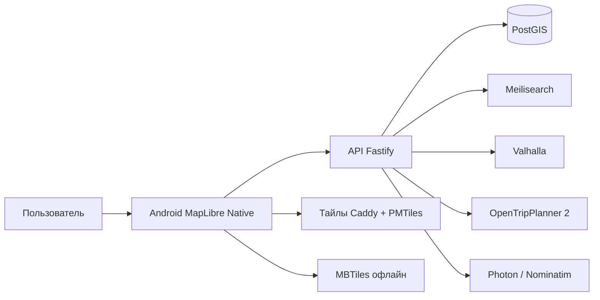
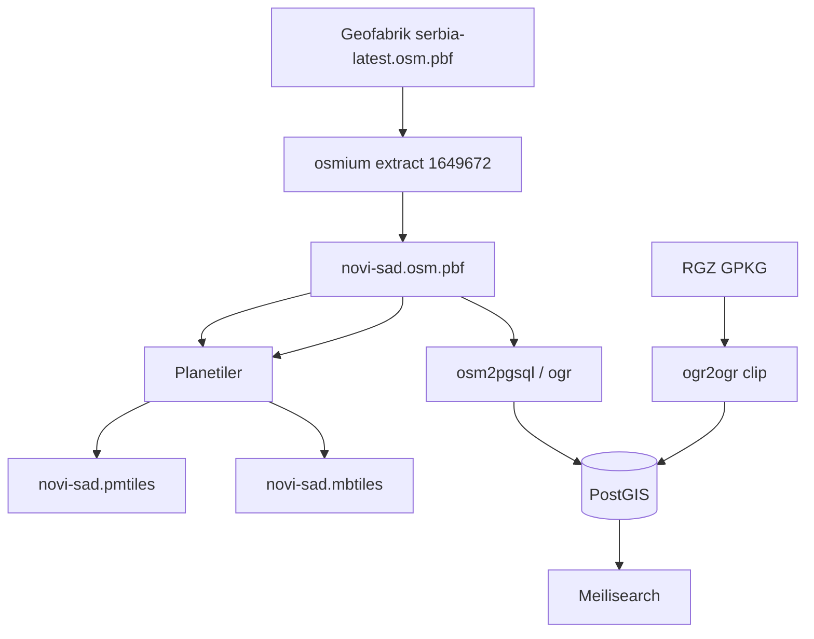

# Архитектура Zylos

Клон 2ГИС для **Grad Novi Sad** (OSM relation `1649672`). Клиент v1 — нативный Android; веб — референс контракта. Спека телефона: [MOBILE.md](MOBILE.md).

Этот файл — как устроены части системы и как они общаются. Продуктовый план: [PLAN.md](PLAN.md). Этапы: [STAGE-01-extract.md](STAGE-01-extract.md), [STAGE-02-postgis.md](STAGE-02-postgis.md), [STAGE-03-meilisearch.md](STAGE-03-meilisearch.md), [STAGE-04-web-map.md](STAGE-04-web-map.md), [STAGE-05-building-click.md](STAGE-05-building-click.md), [STAGE-10-android.md](STAGE-10-android.md), [STAGE-11-android-building.md](STAGE-11-android-building.md), [STAGE-12-android-search.md](STAGE-12-android-search.md). Бюджеты скорости: [PERFORMANCE.md](PERFORMANCE.md). Мобильный клиент: [MOBILE.md](MOBILE.md).

---

## 1. Цель системы

Пользователь на карте Нови-Сада:

1. ищет организацию или адрес;
2. открывает карточку (тип, теги, телефоны, часы, адрес);
3. кликает здание и видит, кто в нём сидит;
4. строит маршрут пешком, на велосипеде, авто или общественным транспортом.

Карта рисуется из **своих тайлов**. Справочник живёт в **своей БД**. Роутинг — **свои движки** на том же OSM-extract. В runtime нет Google Maps, Overpass, PlanPlus и NSmart.

---

## 2. Принципы

1. **Один город, один extract.** Все сервисы едят `data/osm/novi-sad.osm.pbf` и границу `1649672`. Нельзя, чтобы Valhalla резал bbox, а PostGIS — другую relation.
2. **Клиент v1 — Android.** Kotlin + MapLibre GL Native. `apps/web` заморожен как референс API и Style JSON. Capacitor / Flutter / React Native не использовать.
3. **API на TypeScript (Fastify).** Геосервисы — готовые бинарники в Docker. Бэкенд **не** переписывать на Go/Rust.
4. **Справочник важнее подложки.** PMTiles без `organization` / `building` в PostGIS — это карта, не 2ГИС.
5. **Два контура записи организаций.** `source = osm` (импорт) и `source = editorial` (админка). Импорт не затирает editorial.
6. **ODbL и открытые данные.** Атрибуция OSM и RGZ на карте и в «О приложении». Производная БД — share-alike по смыслу ODbL.
7. **Сеть не источник правды.** Публичные API OSM/Overpass только в ETL-скриптах этапа 1 (Geofabrik), не из приложения.

---

## 3. Контекст (C4)



Клиент **не** ходит в Valhalla/OTP/PostGIS напрямую. Все запросы справочника и маршрутов идут через API: единые таймауты, логи, ключи, обрезка по городу.

Исключение: векторные тайлы. Online — устройство читает PMTiles само (HTTP Range). Offline — локальный MBTiles. API тайлы не проксирует.

---

## 4. Контейнеры v1

| Контейнер | Технология | Ответственность |
|---|---|---|
| `web` | React, TypeScript, MapLibre GL JS | Референс API и стиля; **не развиваем** |
| `android` | Kotlin, MapLibre GL Native | Карта (MBTiles), поиск, sheet, карточка, маршрут; геолокация |
| `api` | Fastify, TypeScript | HTTP JSON, авторизация админки, оркестрация поиска и роутинга |
| `postgis` | PostgreSQL 16 + PostGIS | Здания, адреса, организации, граница города, позже GTFS-метаданные |
| `meilisearch` | Meilisearch | Префиксный поиск адреса и организации |
| `tiles` | Caddy + файл PMTiles | Подложка OpenMapTiles, Range-запросы |
| `valhalla` | Valhalla | walk / bicycle / auto |
| `otp` | OpenTripPlanner 2 | Пешая доноска + автобус JGSP (GTFS) |
| `photon` | Photon или Nominatim | Геокодинг «улица + дом», если Meilisearch не хватает для опечаток |
| `etl` | скрипты + osmium/osm2pgsql/ogr2ogr | Не сервис 24/7: импорт OSM/RGZ по команде |

Сейчас в репозитории подняты `postgis`, `tiles`, `tile-api`, `meilisearch`, `api`. Клиент v1 — `apps/android`. Имена контейнеров не менять.

---

## 5. Потоки данных

### 5.1. Холодный путь (ETL)



- Этап 1: Geofabrik → extract → PMTiles.
- Этап 2: extract + RGZ → PostGIS, точка-в-полигоне.
- Этап 3: PostGIS → индекс Meilisearch.
- Позже: тот же PBF → граф Valhalla; PBF + GTFS → OTP.

Повторный ETL **не** пересобирает PMTiles без нужды и не меняет relation.

### 5.2. Тёплый путь (пользователь)

| Действие | Клиент | Сервер |
|---|---|---|
| Панорама, зум | MapLibre читает PMTiles | нет |
| Ввод в поиск | debounce → `GET /search?q=` | Meilisearch, fallback Photon |
| Клик по POI / пину | `GET /orgs/:id` | PostGIS |
| Клик по зданию | точка → `GET /buildings/at?lon=&lat=` | `ST_Contains` / `ST_DWithin` |
| Карточка здания | `GET /buildings/:id` | здание + адреса + организации |
| Маршрут walk/bike/car | `POST /route` mode= | Valhalla, геометрия в GeoJSON |
| Маршрут ОТ | `POST /route` mode=transit | OTP2 |
| Админка | формы → `PUT /orgs/:id` | PostGIS `source=editorial` + reindex |

Клиент после `/buildings/at` подсвечивает полигон здания (GeoJSON), не ищет контур в тайлах. Тайлы — картинка; источник истины контура — PostGIS.

---

## 6. Клиент

- Карта на весь экран, поиск **снизу**, карточка объекта над поиском (2GIS Android) — [design/MOBILE-DESIGN.md](design/MOBILE-DESIGN.md). Веб: search сверху.
- Android: MapLibre `MapView`; веб (референс): URL (`/?org=`, `/?bldg=`). Тап по зданию на телефоне — [STAGE-11-android-building.md](STAGE-11-android-building.md): `GET /v1/buildings/at` → GeoJSON `selected-building` → bottom sheet → `GET /v1/orgs/:id`. Поиск — [STAGE-12-android-search.md](STAGE-12-android-search.md): `GET /v1/search` (debounce 150 ms), dropdown над нижней строкой, маркер `selected-marker`, Room-история.
- Слои: подложка MVT (PMTiles online / MBTiles offline); поверх — выбранное здание из PostGIS, пины, линия маршрута.
- Геолокация только с разрешения; без неё центр **19.845, 45.255**.
- Языки UI: sr-Latn (основной), ru, en позже. Адреса хранить sr-Latn + sr-Cyrl.
- Сборка Android: Gradle. Веб не упаковываем в Capacitor.

Клиент не содержит ключей БД и не знает URL Valhalla.

---

## 7. API

Базовый префикс `/v1`. JSON, CORS только на свой веб-origin.

Минимальный контракт (OpenAPI появится отдельным этапом, смысл операций фиксирован здесь):

| Метод | Назначение |
|---|---|
| `GET /v1/search` | `q`, `lat`, `lon`, `limit`; смешанная выдача: address / organization |
| `GET /v1/orgs/:id` | карточка организации |
| `GET /v1/orgs` | bbox + category для пинов на зуме (лимит, не все POI города сразу) |
| `GET /v1/buildings/at` | `lon`, `lat` → здание или 404 |
| `GET /v1/buildings/:id` | контур, адреса, организации |
| `GET /v1/addresses/:id` | адрес + здание |
| `POST /v1/route` | `from`, `to`, `mode`: `walk` \| `bike` \| `car` \| `transit` |
| `GET /v1/transit/routes` | список линий GTFS |
| `GET /v1/transit/routes/:id` | shape + остановки |
| `PUT /v1/admin/orgs/:id` | editorial, отдельно от публичного API |

Ошибки: `404` нет объекта, `422` точка вне города, `504` роутер не ответил вовремя. Точка вне `city_boundary` не маршрутизируется «через всю Сербию».

---

## 8. Модель данных

Источник истины — PostGIS, схема как в этапе 2:

```text
city_boundary 1─── содержит все геометрии города
category 1───* organization
building 1───* address
building 1───* organization
address  1───* organization     (nullable)
```

- `building.geom` — полигон 4326.
- `address.geom` / `organization.geom` — точки 4326.
- `organization.source`: `osm` | `editorial`.
- `address.source`: `osm` | `rgz`.
- Транспорт: таблицы из GTFS (`agency`, `routes`, `stops`, `shapes`) или OTP как система записи линий; **не** дублировать линии вручную в `organization`.

Meilisearch — проекция для поиска, не мастер. После editorial — обязательный reindex документа.

---

## 9. Карта и роутинг

| Задача | Движок | Вход |
|---|---|---|
| Подложка, здания как «картинка» | Planetiler → PMTiles, схема OpenMapTiles | тот же PBF |
| walk / bike / car | Valhalla | тот же PBF |
| Автобус + пешая доноска | OTP2 | PBF + GTFS JGSP |
| Геокодер-добор | Photon | тот же PBF |

Стили: OpenMapTiles-слой нельзя кормить стилем Protomaps Basemaps — имена слоёв разъедутся.

Live GPS автобусов в v1 нет.

---

## 10. Репозиторий

Целевая монорепа (части появляются по этапам):

```text
Zylos/
  Docs/                 план, этапы, архитектура, SLO
  apps/android/         Kotlin + MapLibre Native
  apps/web/             референс (не развиваем)
  apps/api/             Fastify
  infra/                Caddy, PostGIS SQL, OTP/Valhalla конфиги
  scripts/              ETL, build-mbtiles
  data/                 extract, тайлы, RGZ сырьё — не в git (кроме boundary)
  docker-compose.yml
```

Общие типы и клиент OpenAPI — `packages/shared`, когда появится контракт. До контракта не плодить вторую модель «для фронта».

---

## 11. Границы доверия и секреты

- PostGIS слушает `127.0.0.1` в dev. В проде — внутренняя сеть, не internet.
- Пароли только `.env`, не в git.
- Админка за логином; публичный API чтения без аккаунта.
- Пользовательские аккаунты и избранное — не v1.
- Загрузка файлов пользователей — не v1 (нет отзывов/фото).

---

## 12. Отказы и деградация

| Падает | Поведение клиента |
|---|---|
| Тайлы | Сообщение «карта недоступна», поиск можно оставить |
| API/PostGIS | Карта живая, карточки и клик по зданию нет |
| Meilisearch | Поиск 503 / «поиск недоступен»; карта работает |
| Valhalla | Режимы walk/bike/car недоступны, ОТ может жить |
| OTP | Transit недоступен, остальные режимы живут |
| Photon | Поиск только Meilisearch |

Не прятать ошибку роутера бесконечным спиннером: лимит времени см. [PERFORMANCE.md](PERFORMANCE.md).

---

## 13. Что архитектура запрещает

- Google Maps SDK, Mapbox как единственная подложка.
- Capacitor / Flutter / React Native; развитие `apps/web` как продукта.
- Клиент → Valhalla в обход API.
- Overpass в проде.
- Скрейп PlanPlus / 011info / NSmart.
- Свой велосипед A* вместо Valhalla/OTP.
- Несколько границ города в разных сервисах.

---

## 14. Эволюция по этапам

| Этап | Архитектурный сдвиг |
|---|---|
| 1 | Появляются extract, PMTiles, пустой PostGIS |
| 2 | PostGIS становится мастер-справочником |
| 3 | Meilisearch — поисковый индекс |
| 4 | Появляется `apps/web` поверх тайлов + API |
| 5 | Клик по зданию читает PostGIS, не тайлы |
| 6 | Админка editorial |
| 7 | Valhalla за API `/route` |
| 8–9 | GTFS + OTP |
| 10 | `apps/android` MapLibre Native, MBTiles ([STAGE-10-android.md](STAGE-10-android.md)) |

Новый город = новый extract и те же контейнеры, не форк приложения.
