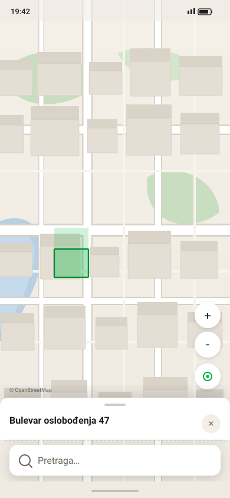

# Карточка объекта (здание / организация)

Спецификация поведения и размеров **object sheet** — bottom sheet над search dock. Палитра и токены — [MOBILE-DESIGN.md](../MOBILE-DESIGN.md) §3.



## Открытие

При **тапе по зданию** на карте или **выборе hit** в поиске (организация / адрес):

1. Dropdown поиска и клавиатура **закрываются** (search dock остаётся видимым снизу).
2. Камера летит к объекту (см. ниже — **разное** позиционирование для тапа и поиска).
3. Карточка появляется **над** search dock, нижний край карточки — **на 8 dp выше** верхнего края search card (`sheet_search_gap`).
4. Начальное состояние — **шаг 1** (минимальный размер).

### Камера

| Источник | Позиция объекта на экране |
|---|---|
| **Тап по карте** | Геометрический центр MapView (≈ **50%** высоты экрана) |
| **Выбор из поиска** (ORG / ADR hit → подсветка здания или маркер org) | **75%** высоты экрана **от нижнего края** |

Padding считается **как при карточке шага 2** (half = **50%** контентной зоны): нижняя половина экрана закрыта sheet + search dock, объект — **в центре оставшейся верхней половины карты**, а не в центре всего экрана. Иначе здание / маркер оказывается под карточкой, когда пользователь разворачивает её на шаг 2. На шаге 1 объект будет чуть выше центра MapView — ожидаемо.

Реализация: `easeTo` / `flyTo` с **bottom padding** ≈ половина MapView (или эквивалентный anchor `search_flyto_anchor_y = 0.75` — доля высоты **от низа**). Zoom и duration — как в STAGE-12 (≥ 16, ≤ 800 ms).

Search dock **не перекрывается** карточкой и **не скрывается** — пользователь может сразу начать новый поиск.

## Три шага (размера)

Карточка имеет ровно **3 фиксированных якоря**. Переход только дискретный, без произвольной высоты.

| Шаг | Имя | Высота | Содержимое |
|---|---|---|---|
| **1** | minimal | **72 dp** | Краткая информация + **×** справа |
| **2** | half | **50%** контентной зоны¹ | Полная информация; скролл, если не помещается |
| **3** | full | **100%** контентной зоны¹ | Полная информация; скролл, если не помещается |

¹ *Контентная зона* — от нижнего края status bar до `sheet_search_gap` над search dock. На эталонном экране 390×844 px это ≈ **710 dp**; шаг 2 ≈ **355 dp**, шаг 3 ≈ **710 dp**.

### Шаг 1 — minimal

- Drag handle сверху (36×4 dp), как у остальных шагов.
- Кнопка **×** (36 dp touch, circle `#F3EFE8`) — **справа** в одной строке с заголовком.
- **Здание:** одна строка — **адрес** (16 sp SemiBold). Подзаголовок и список org **не** показываются.
- **Организация:** **название** (16 sp SemiBold) + **тип/категория** (12 sp muted) под названием.
- Body (поля, список org) **скрыт** — только header-зона шага 1.

### Шаг 2 — half

- Handle + header как сейчас: заголовок, подзаголовок (для здания — «N organizacija»), **×** справа.
- **Здание:** полный список org (имя + категория), разделители `line`.
- **Организация:** все поля карточки (телефон, сайт, адрес, часы…).
- Если контент длиннее viewport — **вертикальный скролл** внутри body; header (handle + title + ×) **закреплён**.

### Шаг 3 — full

- Те же header и body, что на шаге 2, но карточка занимает **весь** контентный слой до search dock.
- Скролл body обязателен при переполнении.
- Карта видна только в узкой полосе над карточкой (или не видна — допустимо на маленьких экранах).

## Жесты и переходы

| Действие | Результат |
|---|---|
| Свайп **вверх** по карточке (или тап по handle) | +1 шаг (1→2→3); на шаге 3 — без эффекта |
| Свайп **вниз** по карточке | −1 шаг (3→2→1); на шаге 1 — без эффекта |
| Тап **×** | Закрыть карточку; снять подсветку здания / маркер поиска |
| Тап по org в списке (шаг ≥ 2) | Открыть карточку org (заменяет карточку здания) |

Анимация смены шага — **≤ 250 ms** (U2). `BottomSheetBehavior` с кастомными anchor heights или эквивалент.

**Не закрывать** карточку свайпом вниз с шага 1 — только уменьшение шага; полное закрытие только через **×** (или новый map pick / clear search по логике STAGE-11/12).

## Компоновка относительно search

```text
┌─────────────────────────────────────┐
│  status bar                         │
│           MapView                   │
│  ╭── object sheet (step 1/2/3) ──╮  │
│  │ handle · title ··········· × │  │
│  │ body (scroll on step 2/3)    │  │
│  ╰──────────────────────────────╯  │
│           ↑ sheet_search_gap 8dp    │
│  ┌─────────────────────────────┐    │
│  │  🔍  Pretraga…            × │    │  ← search dock (всегда)
│  └─────────────────────────────┘    │
│  nav bar inset                      │
└─────────────────────────────────────┘
```

| Token | Значение |
|---|---|
| `sheet_search_gap` | **8 dp** — зазор между низом sheet и верхом search card |
| `sheet_step1_height` | **72 dp** |
| `sheet_step2_ratio` | **0.5** — доля контентной зоны |
| `sheet_step3_ratio` | **1.0** — до status bar |
| `search_flyto_anchor_y` | **0.75** — вертикальная позиция объекта при flyTo из поиска (доля высоты экрана **от нижнего края**) |

Controls (zoom, attribution) сдвигаются вверх на `search_dock_height + sheet_height + sheet_search_gap`.

## Макеты

Перегенерация: `python Docs/design/generate_object_card.py`.

### Здание (тап по карте)

| Шаг | Файл |
|---|---|
| 1 — адрес | [01-building-step1.svg](01-building-step1.svg) |
| 2 — список org | [02-building-step2.svg](02-building-step2.svg) |
| 3 — список org, скролл | [03-building-step3.svg](03-building-step3.svg) |

### Организация (тап по org / поиск)

| Шаг | Файл |
|---|---|
| 1 — название + тип | [04-org-step1.svg](04-org-step1.svg) |
| 2 — поля | [05-org-step2.svg](05-org-step2.svg) |
| 3 — поля, скролл | [06-org-step3.svg](06-org-step3.svg) |

### Из поиска (dropdown закрыт)

| Сценарий | Файл |
|---|---|
| Выбор ORG hit | [07-search-select-org.svg](07-search-select-org.svg) |
| Выбор ADR hit → здание | [08-search-select-building.svg](08-search-select-building.svg) |

## Связанные документы

- [MOBILE-DESIGN.md](../MOBILE-DESIGN.md) §4.3 — визуал sheet
- [screens/README.md](../screens/README.md) — общие экранные кейсы (legacy-имена peek/half)
- [STAGE-11-android-building.md](../../STAGE-11-android-building.md), [STAGE-12-android-search.md](../../STAGE-12-android-search.md) — реализация

При расхождении — **этот файл** задаёт поведение карточки; MOBILE-DESIGN — токены и стиль.
