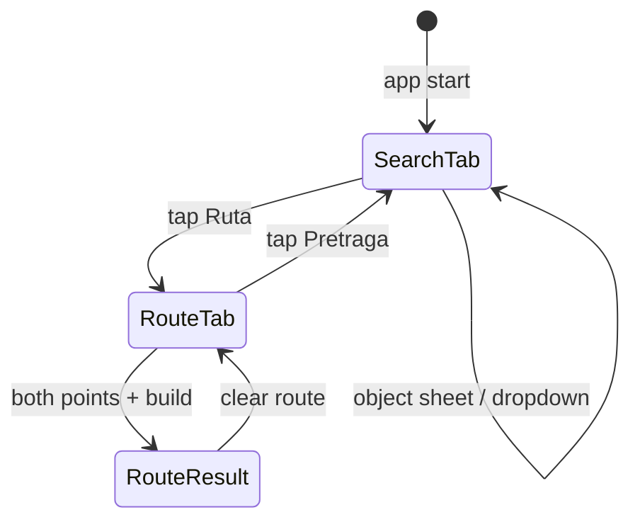

# v2 — нижняя полоса Search / Route (2GIS)

Специфика изменений макетов относительно **v1**. Применяется к STAGE-14 и всем экранам с нижним dock.

Связано: [../../route/README.md](../../route/README.md), [../../MOBILE-DESIGN.md](../../MOBILE-DESIGN.md), [../README.md](../README.md).

---

## 1. Что меняется (summary)

| # | Было (v1) | Стало (v2) |
|---|---|---|
| 1 | Одна search card снизу | **Tab bar** внизу: **Pretraga** + **Ruta** (как 2GIS) |
| 2 | Chip «Ruta» внутри search dock | Tab **Ruta** в полосе; отдельного chip **нет** |
| 3 | По умолчанию browse + search | По умолчанию активна вкладка **Pretraga** |
| 4 | routeChrome — отдельная панель с Od/Do labels | **Route panel** — карточка с двумя **горизонтальными** строками |
| 5 | Long-press на карте для To | Кнопка **на карте** (pin) в каждой строке |
| 6 | Режимы Prevoz / Pešačenje / Auto (третий серый) | Два режима: **Peške** + **Prevoz** (v1 STAGE-14) |

---

## 2. Нижняя полоса (bottom tab bar)

**Всегда видна** на главном экране карты (кроме fullscreen backlog). Расположение: **над** system navigation bar.

```text
┌─────────────────────────────────────┐
│  … контент панели (search / route)  │
├─────────────────────────────────────┤
│   🔍 Pretraga    │    🧭 Ruta       │  ← tab bar, h = 56 dp
└─────────────────────────────────────┘
│  system nav bar                     │
```

| Token | Значение |
|---|---|
| `bottom_tab_height` | **56 dp** |
| `bottom_tab_bg` | `#FFFFFF` |
| `bottom_tab_divider` | `#E4DDD3` (line сверху) |
| Active tab | icon + label `accent` `#00B341`, indicator 2 dp снизу сегмента |
| Inactive tab | icon + label `muted` `#6A655C` |

**Поведение:**

1. **По умолчанию** активна **Pretraga** (`BottomTab.Search`).
2. Тап **Ruta**, если не активна → панель над tab bar **меняется** с search bar на route panel; активный tab = Ruta. Если выбрано **здание / org / точка** — в **Do** подставляется **адрес** (label + coords); **Od** = GPS при наличии. Кнопки **«Ruta do ovde»** в object sheet **нет**.
3. Тап **Pretraga**, если не активна → route panel **меняется** на search bar; активный tab = Pretraga.
4. Переключение tab **не** закрывает object sheet / route result sheet — только меняет нижнюю панель.
5. Object sheet `marginBottom` = **верх tab bar** + `sheet_search_gap` (8 dp), не верх search field v1.
6. Когда **Od и Do заполнены** (непустые label/coords), правая половина tab bar **меняется**: вместо вкладки **Ruta** — CTA **«Napravi rutu»** (build a route), фон `accent`, текст белый.
7. Тап **«Napravi rutu»** → `POST /v1/route` (режим по выбранной иконке транспорта); UI → loading ([06-route-loading.svg](../../route/06-route-loading.svg)) → result sheet.

| Состояние tab bar (route active) | Правая половина |
|---|---|
| Od или Do пусто | **Ruta** (обычная вкладка) |
| Od **и** Do заполнены | **Napravi rutu** (CTA) |
| После тапа CTA | **Napravi rutu** + spinner (loading) |

---

## 3. Панель Pretraga (активна вкладка Search)

Без изменений по содержимому относительно STAGE-12:

- одна строка: иконка 🔍 + `EditText` + ×
- высота **52 dp**, rx **14**, margin **16 dp** по бокам
- dropdown autocomplete растёт **вверх** от панели

`sheet_search_gap` и flyTo anchor — от **верха tab bar**, не от search card.

---

## 4. Панель Ruta (route panel)

Показывается **вместо** search bar, когда активна вкладка **Ruta**. Контейнер: `358×172 dp` (ориентир), rx **16**, `paper`, shadow `sh-card`.

### 4.1. Контейнер route panel (v2.1)

| Правило | Значение |
|---|---|
| Ширина | **100%** экрана (`match_parent`), **без** боковых margin |
| Углы | **Без** скругления (`rx=0`) |
| Зазор до tab bar | **0** — panel вплотную к полосе Pretraga \| Ruta |
| Верх | линия-разделитель `#E4DDD3`; autocomplete **пристыкован** без зазора |

### 4.2. Строка From (Od)

`[Moja lokacija]` · `[поле Odakle?]` · `[Na karti]` — в одну строку.

| # | Элемент | Размер | Поведение |
|---|---|---|---|
| 1 | **Moja lokacija** | **40×40 dp** | GPS; **disabled** (opacity 0.38) без разрешения |
| 2 | **Поле ввода** | flex, h **44 dp** | autocomplete; placeholder «Odakle?» |
| 3 | **Na karti** | **40×40 dp** | выбор From на карте |

**Без** зелёной/красной точки-коннектора между строками.

### 4.3. Строка To (Do)

`[поле Kuda?]` · `[Na karti]` — поле **выровнено** с полем From (отступ слева = ширина кнопки GPS + gap).

**Без** красной точки-спейсера.

### 4.3.1. Swap (поменять местами)

**Справа от** кнопок «Na karti» (колонка From/To):

| Элемент | Размер | Поведение |
|---|---|---|
| **Zameni** (↕) | **36×92 dp** (ширина × от верха верхней «Na karti» до низа нижней) | touch; меняет местами значения Od ↔ Do (label + coords) |

Верхний край swap = верх «Na karti» (From); нижний = низ «Na karti» (To). Макет: [18-route-swap.svg](../../route/18-route-swap.svg).

**Swap при уже построенном маршруте** (состояние Result): после обмена Od ↔ Do клиент **сразу** вызывает `POST /v1/route` с новыми точками — повторный тап **Napravi rutu** не нужен. Показывается loading (как после первого build), затем обновляются линия на карте и route sheet. In-flight запрос отменяется (тот же debounce/cancel, что при ручной смене From/To).

### 4.4. Тип транспорта (иконки)

Под строками — **низкая** полоса (**36 dp**): две **иконки** (не текстовые pill):

| Режим | Иконка (v1 placeholder) | API |
|---|---|---|
| Пешком | силуэт пешехода | Valhalla — после STAGE-14 |
| ОТ | силуэт автобуса | `POST /v1/route` transit; **default** |

Active: фон `#E7F8EC`, stroke `#00B341`.

### 4.5. Autocomplete из route panel

Список hits — **как в Pretraga** (ORG/ADR badges, те же строки), но:

- ширина **100%** экрана;
- **без** зазора между списком и route panel (общий белый блок).

### 4.6. Route results sheet (после расчёта)

Спека и макеты: [../../route/README.md](../../route/README.md) §4.

- Results **flush** к route panel; **без зазора**, **без** скругления; **default = step2**.
- Каждый itinerary — **вложенная карточка**; carousel ↔; **активная по центру** (без peek).
- **Точки** над карточкой; step1 — точки вместо текста «N varijante».
- Активная карточка → линии на карте; `fitBounds` в **верхние 50%** экрана.
- step1 — Od → Do (+ точки если >1 вариант). Закрытие — **×** only.

### 4.7. Построение маршрута

1. Пользователь заполняет Od и Do.
2. Tab **Ruta** → **Napravi rutu** (§2 п.6).
3. Тап **Napravi rutu** → расчёт (`06-route-loading.svg` → `07`…).

**Первый** расчёт — только по тапу **Napravi rutu** (авто-build при заполнении полей **не** используется).

**Исключение — swap после Result:** тап ↕ при уже показанном маршруте → auto-rebuild (§4.3.1), без второго тапа CTA.

---

## 5. Переключение Search ↔ Route



| Действие | Search tab | Route tab |
|---|---|---|
| Старт приложения | active, search bar | inactive |
| Tap Ruta | search bar → **скрыта** | route panel → **видна** |
| Tap Pretraga | search bar → **видна** | route panel → **скрыта** |
| Выбран org/building/point + tap **Ruta** | search bar | route panel; **Do** = адрес объекта |
| Route result на карте | route tab **остаётся** active | route panel + result sheet |

---

## 6. Какие макеты обновить

### 6.1. Уже обновлено (v2)

| Путь | Действие |
|---|---|
| [../../route/*.svg](../../route/) | Перегенерированы `generate_route_screens.py` |

### 6.2. Требуют обновления

| Путь | Изменение |
|---|---|
| [../../screens/*.svg](../../screens/) | Добавить `bottom_tab_bar(active=search)` под search dock; `SEARCH_Y` / `SHEET_BOTTOM` + **64 dp** (tab bar + gap) |
| [../01–08-*.svg](../) | Object sheet: `marginBottom` от tab bar; на макетах видна полоса Pretraga \| Ruta |
| [../../map-screen.svg](../../map-screen.svg) | Tab bar + search (Pretraga active) |
| [../../MOBILE-DESIGN.md](../../MOBILE-DESIGN.md) §2 | Диаграмма компоновки + tokens `bottom_tab_*` |
| [../../../STAGE-14-android-transit.md](../../../STAGE-14-android-transit.md) | Route UX: tab bar вместо chip / routeChrome v1 |

### 6.3. Генераторы

| Скрипт | Задача |
|---|---|
| `generate_screens.py` | Функции `bottom_tab_bar()`, пересчёт `SEARCH_Y` |
| `generate_object_card.py` | Tab bar на всех object-card SVG |
| `generate_route_screens.py` | ✅ v2 route panel |

---

## 7. Design tokens (новые)

| Token | Значение |
|---|---|
| `bottom_tab_height` | 56 dp |
| `bottom_tab_panel_gap` | 8 dp |
| `route_panel_height` | 160 dp |
| `route_row_height` | 44 dp |
| `route_side_btn` | 40 dp |
| `route_mode_height` | 36 dp (иконки, не pill) |
| `route_panel_radius` | **0** |
| `route_panel_margin_h` | **0** |
| `route_loc_disabled_alpha` | 0.38 |

---

## 8. Чеклист приёмки v2

- [ ] Tab bar виден на browse, search, route, object sheet
- [ ] Default tab = **Pretraga**
- [ ] Ruta tab → search bar заменяется route panel (без chip)
- [ ] From row: loc (disabled) + input + map btn в одну строку
- [ ] To row: red dot spacer + input + map btn
- [ ] Ровно **2** mode pills: Peške, Prevoz
- [ ] Object sheet не перекрывает tab bar
- [ ] Dropdown route/search растёт вверх от соответствующей панели
- [ ] Od+Do заполнены → tab **Napravi rutu**; тап → расчёт
- [ ] Swap ↕ между From/To меняет значения местами
- [ ] Swap при Result → auto `POST /v1/route`, без тапа Napravi rutu
- [ ] Выбран object → tap Ruta → Do = адрес; без «Ruta do ovde» в sheet

---

*v2. 2026-09. Ориентир — 2GIS Android bottom tabs + route card.*
