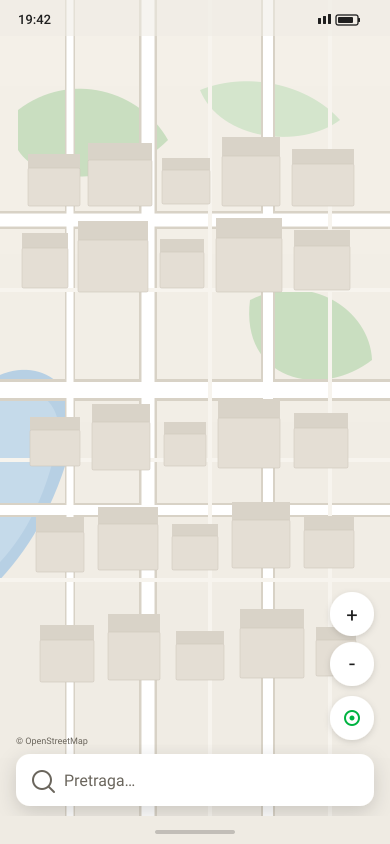
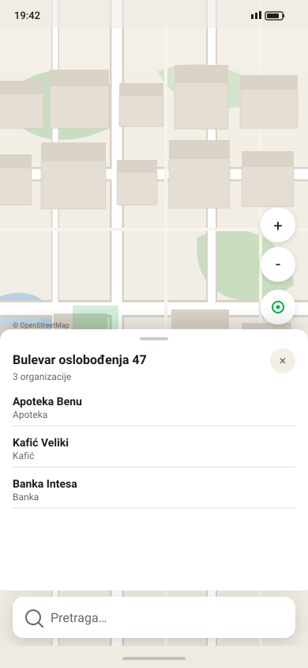
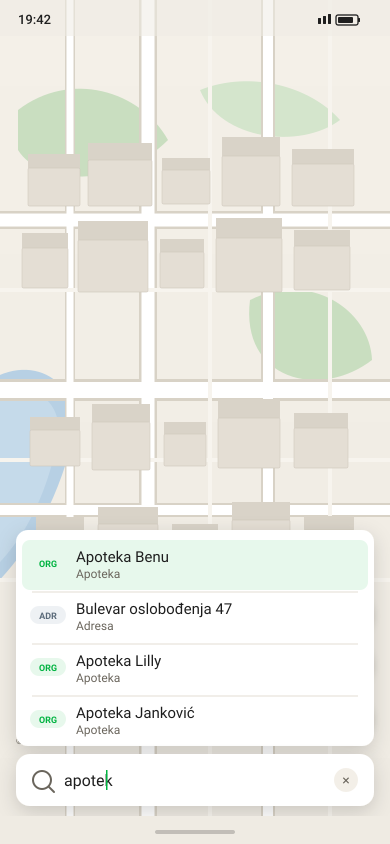

# Экраны Android (ориентир 2GIS)

Мокапы пользовательских кейсов. Компоновка: карта на весь экран, **поиск снизу**, карточка **над** поиском. Палитра — [MOBILE-DESIGN.md](../MOBILE-DESIGN.md) §3.

**Карточка объекта (3 шага):** канонические макеты и поведение — **[object-card/README.md](../object-card/README.md)**. Экраны `05`/`06`/`08` здесь — legacy-имена (peek/half).

Открывать в браузере (двойной клик или `start путь.svg`). Перегенерация: `python Docs/design/generate_screens.py`.

## 1. Browse — карта

| Шаг | Экран |
|---|---|
| Карта без выбора | [01-browse-idle.svg](01-browse-idle.svg) |
| Org-пины, zoom 15 (без подписей) | [02-browse-poi-z15.svg](02-browse-poi-z15.svg) |
| Org-пины, zoom 17 (подписи) | [03-browse-poi-z17.svg](03-browse-poi-z17.svg) |

## 2. Тап по зданию

| Шаг | Экран |
|---|---|
| Запрос справочника | [04-building-loading.svg](04-building-loading.svg) |
| Peek: адрес + число org | [05-building-peek.svg](05-building-peek.svg) |
| Half: список организаций | [06-building-org-list.svg](06-building-org-list.svg) |
| Здание без org | [07-building-empty.svg](07-building-empty.svg) |
| Карточка организации | [08-org-card.svg](08-org-card.svg) |
| Закрытие: контур снят | [23-building-closed.svg](23-building-closed.svg) |
| 404 — нет здания | [09-error-no-building.svg](09-error-no-building.svg) |
| 422 — вне города | [10-error-outside-city.svg](10-error-outside-city.svg) |
| Нет сети (карта жива) | [11-error-offline.svg](11-error-offline.svg) |

## 3. Поиск

| Шаг | Экран |
|---|---|
| Фокус, пустое поле → Nedavno | [12-search-history.svg](12-search-history.svg) |
| 1 символ — без запроса | [13-search-short-query.svg](13-search-short-query.svg) |
| Debounce, spinner | [14-search-loading.svg](14-search-loading.svg) |
| Dropdown вверх | [15-search-hits.svg](15-search-hits.svg) |
| Клавиатура (IME) | [19-search-keyboard.svg](19-search-keyboard.svg) |
| 0 hits | [16-search-empty.svg](16-search-empty.svg) |
| Офлайн | [17-search-offline.svg](17-search-offline.svg) |
| Meilisearch 503 | [18-search-unavailable.svg](18-search-unavailable.svg) |
| Выбор ORG → маркер + карточка | [20-search-selected-org.svg](20-search-selected-org.svg) |
| Выбор ADR → здание + контур | [21-search-selected-address.svg](21-search-selected-address.svg) |
| Search Multi (категория на карте) | [22-search-multi.svg](22-search-multi.svg) |

