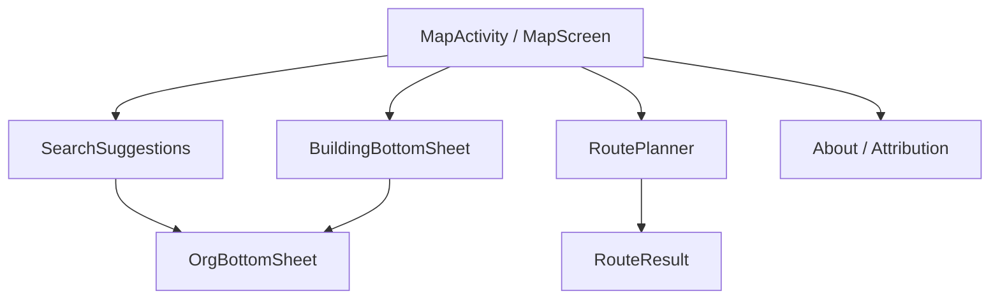

# Мобильное приложение Zylos (Android)

Спецификация **нативного** Android-клиента для **Grad Novi Sad** (OSM relation `1649672`). Продукт — клон 2ГИС: карта на весь экран, **поиск снизу** (как 2GIS Android), карточка объекта над строкой поиска, маршруты общественного транспорта.

Продуктовый ориентир: [mobile_plan.md](mobile_plan.md). Этот документ — **реализация в стеке Zylos** (без Pelias, без Google Places, без переписывания бэкенда).

Связанные документы:

- [design/MOBILE-DESIGN.md](design/MOBILE-DESIGN.md) — **UI/UX и design tokens** (ориентир 2GIS)
- [ARCHITECTURE.md](../ARCHITECTURE.md) — контейнеры, API, потоки данных
- [PLAN.md](../PLAN.md) — общий план реализации
- [PERFORMANCE.md](../PERFORMANCE.md) — обязательные SLO (фича не done без порога)
- [design/MOBILE-POI-ZOOM.md](design/MOBILE-POI-ZOOM.md) — ранжирование POI по zoom (browse / search)

**Приоритет разработки:** мобильное приложение. Веб-клиент (`apps/web`) **не развиваем**; он остаётся референсом контракта API и Style JSON, не общим UI.

---

## 1. Платформа и архитектура клиента

### 1.1. Назначение и платформы

| Параметр | Значение |
|---|---|
| **Платформа v1** | Android (Kotlin) |
| **Целевой регион** | Нови-Сад (Grad Novi Sad, relation `1649672`); масштабирование на другие города — после v1 |
| **Минимальный SDK** | API 24 (Android 7.0); целевой — API 34+ |

**Ключевой функционал v1** (из [mobile_plan.md](mobile_plan.md)):

- Высокопроизводительная векторная карта: pan, zoom, **поворот 360°**, **наклон (pitch)**; офлайн-подложка из локального файла
- Поиск адресов и организаций (латиница и кириллица)
- Тап по зданию → список организаций в здании
- Маршрут A→B общественным транспортом (автобус JGSP + пешие участки)

### 1.2. Архитектура Android-клиента

| Решение | Почему |
|---|---|
| **Kotlin** | Нативный Android, производительность карты, офлайн MBTiles |
| **Clean Architecture + MVI/MVVM** | Разделение UI / domain / data; предсказуемое состояние экранов |
| **MapLibre GL Native Android SDK** | OpenGL ES / Vulkan; тот же Style JSON и MVT, что в инфраструктуре Zylos |
| **Room** | Кэш истории поиска, избранное (v1 — опционально), офлайн-метаданные |
| **Retrofit / OkHttp** | HTTP-клиент к `GET/POST /v1/*` |

**Не используем:** Capacitor, WebView, React Native, Flutter, MapLibre GL JS на телефоне, Google Maps SDK, Mapbox как единственная подложка.

**Запрещено:** прямой доступ клиента к Valhalla / OTP / PostGIS / Meilisearch; Google Places; Overpass в runtime; Pelias.

### 1.3. Связь с бэкендом Zylos

Клиент ходит **только** в Fastify `api` (`/v1/*`). Роли сервисов из [mobile_plan.md](mobile_plan.md) сопоставлены так:

| Сервис в mobile_plan | Реализация Zylos |
|---|---|
| API Gateway | `api` (Fastify) + сжатие на reverse-proxy (Caddy); отдельный gateway не заводить |
| POI Service | `GET /v1/buildings/at`, `/buildings/:id`, `/orgs/:id` → PostGIS |
| Routing Service | `POST /v1/route` → OTP2 (transit), позже Valhalla |
| Search Service | `GET /v1/search` → **Meilisearch** (не Pelias); fallback **Photon** при 0 hits |

---

## 2. Функциональные требования

### 2.1. Высокая производительность карты

**Цель:** панорамирование, зум, поворот и наклон без заметных фризов — как 2ГИС / maps.me.

| Аспект | Требование | Порог |
|---|---|---|
| Первый кадр подложки (online) | Улицы видны после открытия | T1 ≤ 1.5 с (4G) |
| Здания на z14 | Видны в центре города | T2 ≤ 2.5 с |
| Жест pan/zoom/rotate | Плавность | T4: ≥ **30 FPS** среднее; фриз ≤ 100 мс |
| Целевой FPS на mid-range | MapLibre Native | до **60 FPS** с лимитом при перегреве / низком заряде |
| Холодный старт приложения | До интерактивной карты | ≤ **5 с** Phone-mid (4G, online) |
| Офлайн-карта (Airplane Mode) | Подложка из assets / диска | T1/T2 ≤ **800 ms** с локального MBTiles |
| Память | После 10 мин pan/поиска | ориентир ≤ **350 MB** RSS процесса |

**Технические меры:**

- **Online:** MVT с `tiles` (HTTP Range к PMTiles) или тот же стиль с удалённым источником
- **Offline:** файл **MBTiles** (`novi-sad.mbtiles`) в `assets` или после загрузки на диск; источник `mbtiles://` в Style JSON
- Style JSON на базе `infra/preview/style.json` (OpenMapTiles-слои, `fill-extrusion` для 3D-зданий)
- Glyphs и спрайты — с контролируемого HTTPS-origin; не блокировать старт
- Рендеринг в GL-потоке MapLibre Native; UI (поиск, sheet) — вне render thread
- Debounce поиска **150 ms**; отмена устаревших запросов (S3)

### 2.2. Визуал «как 2GIS»

Полная спека UI: **[design/MOBILE-DESIGN.md](design/MOBILE-DESIGN.md)** — компоновка, tokens, компоненты, чеклист приёмки.

Кратко:

| Элемент | Описание |
|---|---|
| Компоновка | `MapView` на весь экран; **search card снизу**; **BottomSheet** объекта над поиском — [design/MOBILE-DESIGN.md](design/MOBILE-DESIGN.md) §2 |
| Подложка | MVT/MBTiles; светлая тема v1; accent `#00B341` |
| Здания | Контуры из тайлов; **выбранное** — GeoJSON PostGIS |
| POI | Пины org на z ≥ 15 — [design/MOBILE-POI-ZOOM.md](design/MOBILE-POI-ZOOM.md) |
| Bottom sheet | 3 шага (minimal / half / full) — [design/object-card/README.md](design/object-card/README.md); анимация ≤ 250 ms (U2) |
| Маршрут ОТ | Пешком **пунктир**; автобус **цветная линия** + номер |
| Touch targets | ≥ **48 dp**; contrast ≥ WCAG AA |

### 2.3. Тап по зданию → организации

**Цель:** тап по карте открывает карточку здания со списком организаций.

| Шаг | Поведение |
|---|---|
| 1 | `onMapClick` → координата (lon, lat) |
| 2 | `GET /v1/buildings/at?lon=&lat=` |
| 3 | 404 — haptic + toast «нет здания»; 422 — «вне города»; 200 — `GET /v1/buildings/:id` |
| 4 | GeoJSON-слой подсветки (`FillLayer` / `FillExtrusionLayer`); Bottom sheet: адрес(а), список org |
| 5 | Тап по org → `GET /v1/orgs/:id` — телефоны, часы, сайт |

**Пороги:** B2 p95 ≤ 100 ms (сервер), B4 p95 ≤ 350 ms (до списка в UI).

Контур и список org **не** из `queryRenderedFeatures` по MVT — источник истины **PostGIS** (как в [ARCHITECTURE.md](../ARCHITECTURE.md)). Тайлы — картинка; справочник — API.

### 2.4. Поиск (Meilisearch, не Pelias)

**Цель:** autocomplete по адресу, названию и типу организации.

| Тип запроса | Примеры | Источник |
|---|---|---|
| Адрес | «Булевар ослобођења 47», «булевар 47» | `GET /v1/search` → Meilisearch |
| Организация | «Apoteka Benu», «футошка» | Meilisearch |
| Категория | «аптека», «кафе», «pharmacy» | Meilisearch (`category_name`, `tags`) |
| Опечатки / редкие OSM-имена | редкие случаи | Fallback **Photon** при 0 hits (не Pelias) |

| Требование | Порог |
|---|---|
| Ответ API p95 | S1 ≤ 200 ms e2e (RTT 50 ms) |
| Debounce | 150 ms |
| Результатов | ≤ 15 (S2) |
| Мин. длина | < 2 символов — без запроса (S4) |
| Stale cancel | Coroutine / request id — не перерисовывать устаревший список (S3) |

UI: `RecyclerView` / Compose LazyColumn под строкой поиска; иконка `address` / `organization`; выбор → `easeTo` + карточка.

Геолокация: параметры `lat`, `lon` в `/search` для сортировки по близости.

**Room:** кэш последних N запросов и выбранных hits (офлайн — только история, не полный индекс).

### 2.5. Управление камерой

| Жест | MapLibre Native |
|---|---|
| Панорамирование | Одним пальцем |
| Pinch-to-zoom | Двумя пальцами |
| Поворот | Двумя пальцами, **360°** |
| Наклон (pitch) | Двумя пальцами; лимит **≤ 60°** |
| Двойной тап | Zoom in |
| Кнопки ± | Фиксированный шаг zoom |
| Компас | Сброс bearing → 0 |
| «Моё местоположение» | Fused Location Provider → `easeTo`; только после разрешения |

Центр по умолчанию без GPS: **19.845, 45.255** (центр Нови-Сада), zoom **14**.

Ограничение FPS: `MapRenderer` / настройки MapLibre — целевые **60 FPS** на mid-range; при thermal throttling снижать до 30 FPS (не ниже SLO T4).

### 2.6. Маршруты общественного транспорта

**Цель v1:** A→B автобусом JGSP + пешая доноска. Приоритет **transit** (как в mobile_plan §5).

| Режим | Движок | Приоритет v1 |
|---|---|---|
| **Общественный транспорт** | OpenTripPlanner 2 | **Первый** |
| Пешком | Valhalla | После transit |
| Велосипед / авто | Valhalla | После transit |

**API:** `POST /v1/route` — `{ from, to, mode: transit }`; линии и остановки — `GET /v1/transit/routes/:id`.

| Порог | Значение |
|---|---|
| Transit p95 | R4 ≤ 1.5 с |
| Timeout клиента | 8 с |
| Отрисовка линии после JSON | R9 ≤ 100 ms |

**UI:**

- «Откуда / Куда» — поиск или long-press на карте
- Результат: GeoJSON `LineLayer` — автобус сплошной цвет, пеший участок **dasharray**
- Подписи номеров линий (`SymbolLayer` / overlay)
- Время, пересадки, шаги — в Bottom sheet

Точки вне `city_boundary` → 422 (R8), сообщение пользователю.

### 2.7. Адаптивность и устройства

| Аспект | Подход |
|---|---|
| Layout | ConstraintLayout или Compose; `WindowInsets` (status bar, nav bar, cutout) |
| Bottom sheet | На планшете — max width ~480 dp по центру |
| Touch targets | ≥ 48 dp |
| Ориентация | Portrait — основной; landscape — карта fullscreen, sheet сбоку |

**Профили приёмки** (из mobile_plan §6 + PERFORMANCE):

- Samsung Galaxy A-серия, Xiaomi Redmi (4 GB RAM) — **основной SLO**
- Phone small: 360×640 dp
- Phone mid: 1080×2340, 4 GB RAM

### 2.8. Офлайн

| Режим | Поведение |
|---|---|
| **v1 обязательно** | Карта работает в **Airplane Mode** из локального MBTiles |
| Поиск / org / маршрут offline | Нет полноценного offline; понятное сообщение «нужна сеть» |
| Загрузка карты | v1: bundled в APK (`assets`); позже — фоновый загрузчик обновлений |
| Формат | **MBTiles** (MVT); сборка Planetiler/Tilemaker из `novi-sad.osm.pbf` |
| Zoom offline | **0–16** в mobile_plan; не раздувать без нужды — ориентир ≤ **30 MB** на город |

Офлайн-роутинг на устройстве — **не v1**.

---

## 3. Нефункциональные требования

### 3.1. Сеть и безопасность

- Справочник и маршруты — только `api` (`/v1/*`)
- Тайлы online — напрямую с `tiles` (PMTiles Range); API тайлы не проксирует
- Production: **HTTPS**; certificate pinning — не v1
- Секреты БД — только на сервере; в APK нет ключей Meilisearch / PostGIS
- Base URL API — `BuildConfig.API_URL` (dev / stage / prod)

### 3.2. Геолокация и батарея

- `LocationRequest` с приоритетом BALANCED; continuous updates только на экране навигации (U5)
- Без фонового GPS
- Runtime permission с rationale; отказ не блокирует приложение

### 3.3. Локализация

- UI v1: **sr-Latn**
- Адреса в API: sr-Latn + sr-Cyrl (поля Meilisearch / PostGIS)
- ru, en — после v1

### 3.4. Доступность

- TalkBack labels на кнопках зума, поиска, «назад»
- Конtrast текста в sheet ≥ WCAG AA

---

## 4. Стек и инструменты

### 4.1. Android-клиент

| Компонент | Технология |
|---|---|
| Язык | Kotlin |
| UI | Jetpack Compose (рекомендуется) или XML + ViewBinding |
| Архитектура | Clean Architecture; UI — **MVI** или MVVM |
| Карта | **MapLibre GL Native Android SDK** |
| HTTP | Retrofit + OkHttp + kotlinx.serialization или Moshi |
| Async | Kotlin Coroutines + Flow |
| DI | Hilt |
| Локальная БД | **Room** (история поиска, избранное, метаданные offline-карты) |
| Offline tiles | MBTiles (`novi-sad.mbtiles`) |
| Тесты | JUnit, MockWebServer, Espresso / Compose UI Test |

### 4.2. Бэкенд (без изменения стека Zylos)

| Сервис | Роль |
|---|---|
| `api` (Fastify) | search, orgs, buildings, route |
| `postgis` | здания, организации, граница |
| `meilisearch` | поиск (не Pelias) |
| `tiles` | PMTiles online |
| `otp` | transit |
| `valhalla` | walk / bike / car (после transit) |
| `photon` | fallback geocoder |

Контракт: OpenAPI → `packages/shared` или Kotlin models из той же спеки.

### 4.3. DevOps

| Задача | Инструмент |
|---|---|
| Сборка | Gradle (AGP 8+), JDK 17 |
| CI | GitHub Actions: `./gradlew test`, `lint`, assembleRelease |
| Подпись | keystore в секретах CI |
| Internal testing | Firebase App Distribution |
| Store | Google Play (AAB) |
| Краши | Firebase Crashlytics или Sentry |

### 4.4. Тестирование

| Уровень | Инструмент |
|---|---|
| Unit | JUnit — parsers, mappers DTO → domain |
| Integration | MockWebServer — `/v1/search`, `/buildings/at` |
| UI | Espresso / Compose Test — поиск, sheet |
| E2E device | Maestro — жесты карты, airplane mode карты |
| Performance | Android Studio Profiler — FPS, память; 30 прогонов B4, S1, T4 |

---

## 5. Экраны и навигация



| Экран | Содержимое |
|---|---|
| Карта | MapLibre `MapView`, поиск, FAB геолокации, ± zoom |
| Поиск | Overlay-список в том же Activity |
| Карточка org | Bottom sheet: имя, категория, адрес, телефоны, часы, «маршрут сюда» |
| Карточка здания | Контур на карте, адрес, список org |
| Маршрут | From/To, построить (transit) |
| О приложении | ODbL, OSM, RGZ, версия |

Deep links (v1 опционально): `zylos://org/{id}`, `zylos://building/{id}`.

---

## 6. Этапы разработки

Этапы согласованы с [mobile_plan.md](mobile_plan.md) §4; предусловия Zylos (extract, PostGIS, Meilisearch) **уже закрыты** этапами 1–3.

### Этап 1 — Данные и ГИС (частично готово)

| # | Задача | Статус / критерий |
|---|---|---|
| 1.1 | OSM extract relation 1649672 | **Готово** — `data/osm/novi-sad.osm.pbf` |
| 1.2 | Planetiler → **MBTiles** для Android (`novi-sad.mbtiles`, zoom 0–16) | Скрипт + verify размера ≤ 30 MB |
| 1.3 | GTFS JGSP — валидация | GTFS Validator, без blocker |
| 1.4 | PostGIS + GIST | **Готово** — этап 2 |

### Этап 2 — Бэкенд-сервисы (адаптация под Zylos)

| # | Задача | Критерий |
|---|---|---|
| 2.1 | POI: `/buildings/at`, `/buildings/:id`, `/orgs/:id` | **Готово**; HTTPS с телефона |
| 2.2 | Routing: OTP + GTFS, `POST /v1/route`, `/transit/routes` | R4, R8; 3+ тестовых A→B |
| 2.3 | Search: Meilisearch через `/v1/search` | S1, S2, S4; **Pelias не поднимать** |

### Этап 3 — Android: офлайн-карта

| # | Задача | Критерий |
|---|---|---|
| 3.1 | Проект `apps/android`, MapLibre GL Native | `MapView` + базовый стиль |
| 3.2 | MBTiles в `assets` или загрузчик | Airplane Mode: карта ≤ 800 ms |
| 3.3 | Style JSON: `fill-extrusion`, glyphs, icons | Визуально как `infra/preview/style.json` |
| 3.4 | Жесты: pan, zoom, rotate 360°, pitch ≤ 60° | T4 Phone-mid ≥ 30 FPS |

### Этап 4 — Здание и карточки

Спека и реализация: [STAGE-11-android-building.md](STAGE-11-android-building.md) в `apps/android` (после [STAGE-10-android.md](STAGE-10-android.md)).

| # | Задача | Критерий |
|---|---|---|
| 4.1 | `onMapClick` → `/buildings/at` | B2, B4 |
| 4.2 | Подсветка GeoJSON контура | B6 |
| 4.3 | Bottom sheet: адрес, org; карточка org | B1, B3 |

### Этап 5 — Поиск и маршрут ОТ

Спека autocomplete: [STAGE-12-android-search.md](STAGE-12-android-search.md). Org-пины: [STAGE-13-android-poi.md](STAGE-13-android-poi.md) + [design/MOBILE-POI-ZOOM.md](design/MOBILE-POI-ZOOM.md). Transit: [STAGE-14-android-transit.md](STAGE-14-android-transit.md).

| # | Задача | Критерий |
|---|---|---|
| 5.1 | Autocomplete → `/v1/search` | S1, S3; Room — история — [STAGE-12-android-search.md](STAGE-12-android-search.md) |
| 5.2 | Маршрут transit: линия, пунктир пешком, номера линий | R4, R9 — [STAGE-14-android-transit.md](STAGE-14-android-transit.md) |
| 5.3 | Long-press / поиск для From/To | Ручные сценарии в городе |

### Этап 6 — Оптимизация и тестирование

| # | Задача | Критерий |
|---|---|---|
| 6.1 | Профiling на Samsung A / Redmi | T4, память, thermal |
| 6.2 | Airplane Mode — только карта | MBTiles stable |
| 6.3 | Размер MBTiles и APK | Бюджет размера |

### Этап 7 — Релиз

| # | Задача |
|---|---|
| 7.1 | `city_id` в конфиге — заложить, один город в v1 |
| 7.2 | UI загрузки offline-карт — backlog после v1 |
| 7.3 | Google Play: AAB, listing sr/en, политика конфиденциальности |

---

## 7. Структура репозитория

```text
Zylos/
  apps/
    android/                 Kotlin, MapLibre GL Native
      app/
        src/main/
          assets/
            novi-sad.mbtiles   offline подложка (или split APK)
          java/.../            ui, domain, data
      build.gradle
    web/                       референс API/стиля; не развиваем
  packages/
    shared/                    OpenAPI → Kotlin (когда контракт зафиксирован)
  infra/
    preview/style.json         база для Android Style JSON
  scripts/
    build-mbtiles.ps1          Planetiler → MBTiles для Android
```

Сборка релиза:

```bash
# MBTiles (если ещё нет)
./scripts/build-mbtiles.ps1

# APK/AAB
cd apps/android && ./gradlew bundleRelease
```

---

## 8. Публикация (Google Play)

| Требование | Детали |
|---|---|
| Формат | AAB |
| Target SDK | Текущий mandatory level Google |
| Permissions | `ACCESS_FINE_LOCATION` — обоснование в listing |
| Data safety | Координаты только при использовании навигации |
| Категория | Maps & Navigation |
| Название | **Zylos** (без города в названии; покрытие расширяется) |

iOS — **не v1** (mobile_plan только Android).

---

## 9. Критерии приёмки mobile v1

1. **Функции:** §2.1–2.8; transit end-to-end; карта в Airplane Mode
2. **PERFORMANCE:** T4 Phone-mid, B4, S1, R4 — n ≥ 30, p95 в бюджете
3. **Устройства:** Samsung A-series или Redmi 4 GB — без crash 30 мин
4. **Визуал:** чеклист §2.2 vs 2ГИС/maps.me
5. **Юридическое:** атрибуция ODbL/RGZ; политика конфиденциальности
6. **Store:** internal beta; signed AAB из CI

---

## 10. Риски и митигация

| Риск | Митигация |
|---|---|
| Два формата тайлов (PMTiles web, MBTiles Android) | Один Planetiler extract; два выхода по скрипту; один style.json |
| Style JSON расходится web / native | Единый `infra/preview/style.json` как источник; CI diff слоёв |
| localhost API с телефона | Stage HTTPS; `BuildConfig.API_URL` |
| OTP cold start 90 s | Spinner + timeout 8 s; не блокировать карту |
| GTFS лицензия JGSP | Письмо до этапа 2.2 |
| MBTiles 16 zoom раздувает APK | Maxzoom по профилю устройств; optional download |
| Native UI ≠ web | Web заморожен; OpenAPI — единый контракт |

---

## 11. Связь с этапами PLAN

| Этап PLAN | Mobile (этот документ) |
|---|---|
| 1–3 | **Готово** — данные, PostGIS, Meilisearch |
| 4–5 | Web — референс; mobile повторяет контракт нативно (этапы 4–5 здесь) |
| 6 | Editorial — богаче карточки org; не блокер APK |
| 7–9 | OTP/transit — **этап 2.2 / 5.2** |
| 10 (Capacitor в PLAN) | **Заменён** на `apps/android` MapLibre Native |

---

## 12. Чеклист перед стартом этапа 3 (первая сборка Android)

Закрывается [STAGE-10-android.md](STAGE-10-android.md).

- [x] `GET /v1/search`, `/buildings/at`, `/orgs/:id` — локально (этапы 3–5). С эмулятора: `http://10.0.2.2:3000`. С телефона: `docker-compose.mobile.yml` (HTTP LAN). **HTTPS** — stage/prod, не блокер первой сборки
- [x] DTO `/v1/*` зафиксированы в `apps/api/src/types` и зеркало Kotlin в `apps/android`
- [x] `novi-sad.mbtiles` собран (`scripts/build-mbtiles.ps1`) и подключается в MapLibre Native (`mbtiles://`)
- [x] Style JSON с `fill-extrusion` и glyphs — `infra/preview/style.json`
- [ ] OTP + GTFS — 3+ тестовых маршрута (для этапа 5; можно параллельно)
- [x] Иконки 512×512, adaptive icon, splash — в `apps/android`
- [ ] Google Play Console, keystore, политика конфиденциальности (URL) — вручную, не код

---

## 13. Отличия от mobile_plan.md (намеренные)

| mobile_plan | MOBILE.md (Zylos) |
|---|---|
| Pelias | **Meilisearch** + Photon fallback |
| Google Places | **PostGIS** (`/orgs`, editorial позже) |
| Go/Rust backend | **Fastify** `/v1` |
| `queryRenderedFeatures` для здания | **`/buildings/at`** → PostGIS |
| Capacitor / web UI | **Kotlin + MapLibre GL Native** |
| gRPC / Protobuf | **JSON REST** |

---

*Документ v2. Нативный Android, MapLibre GL Native; поиск — Meilisearch. Следующее обновление — после первой сборки `apps/android`.*
