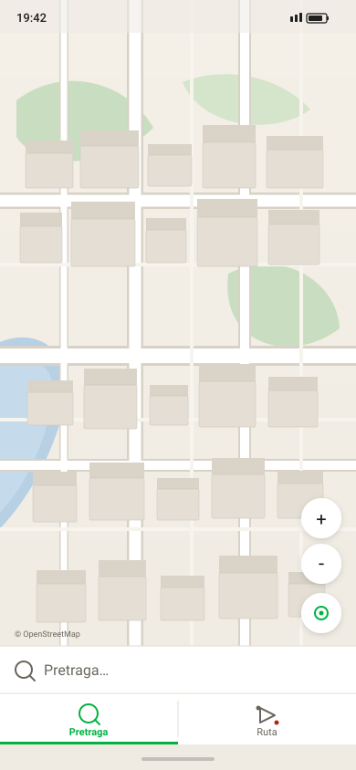

# Маршрут transit (STAGE-14) — дизайн v2

Специфика UI маршрута **A→B** для Android. Ориентир — **2GIS Android**: **tab bar Pretraga | Ruta** внизу; при активной **Ruta** search bar заменяется **route panel**.

Спека изменений v1→v2: [../object-card/versions/v2-bottom-tabs-route-panel.md](../object-card/versions/v2-bottom-tabs-route-panel.md).

Связано: [STAGE-14-android-transit.md](../../STAGE-14-android-transit.md), [MOBILE-DESIGN.md](../MOBILE-DESIGN.md).

Перегенерация: `python Docs/mobile/design/route/generate_route_screens.py`.

---

## 1. Нижняя полоса (tab bar)

| Правило | Значение |
|---|---|
| Высота | **56 dp** |
| Вкладки | **Pretraga** (search) · **Ruta** (route) |
| Default | **Pretraga** active |
| Tap Ruta | search panel → **route panel** |
| Tap Pretraga | route panel → **search panel** |
| Tab bar | **всегда** виден; object/route sheet **над** ним |

### Выбранный объект → Route tab

Если на карте/в поиске **выбрано** здание, организация или точка (object sheet открыт или есть `selected` с coords):

- тап **Ruta** → route panel; **Do** = адрес выбранного (org — поле Adresa; building — адрес здания; точка поиска — label hit);
- **Od** = «Moja lokacija», если GPS доступен; иначе пусто;
- object sheet **не закрывается**;
- отдельной кнопки **Ruta do ovde** в карточках **нет** — только tab **Ruta**.

Макеты: [10-org-selected-search-tab.svg](10-org-selected-search-tab.svg) → [11-org-switch-route-tab.svg](11-org-switch-route-tab.svg).

Макеты: [01-browse-search-tab.svg](01-browse-search-tab.svg), [17-tab-switch-search-to-route.svg](17-tab-switch-search-to-route.svg).

---

## 2. Search panel (вкладка Pretraga)

Панель **на всю ширину**, **без** скругления, **без** зазора до tab bar — по тем же правилам, что route panel (v2.1).

| Правило | Значение |
|---|---|
| Ширина | **100%** экрана |
| Углы | **Без** скругления |
| Зазор до tab bar | **0** |
| Верх | линия `#E4DDD3`; dropdown **пристыкован** без зазора |
| Содержимое | 🔍 + поле «Pretraga…» + × |

Макеты: [01-browse-search-tab.svg](01-browse-search-tab.svg), [16-search-tab-restored.svg](16-search-tab-restored.svg).

---

## 3. Route panel (вкладка Ruta)

Панель **на всю ширину**, **без** скругления, **без** зазора до tab bar (v2.1).

### Строка From

`[Moja lokacija]` · `[поле Odakle?]` · `[Na karti]` — GPS disabled без разрешения.

### Строка To

`[поле Kuda?]` · `[Na karti]` — поле выровнено с From (без цветных точек).

### Тип транспорта

Полоса **36 dp**: две **иконки** (пешеход / автобус).

### Autocomplete

Список hits — как Pretraga, **full width**, пристыкован к panel ([03-route-from-search.svg](03-route-from-search.svg)).

### Swap ↔

Кнопка **↕** справа от «Na karti», на всю высоту обеих строк — меняет Od ↔ Do ([18-route-swap.svg](18-route-swap.svg)).

**Если маршрут уже построен** (Result: линия на карте + route sheet): тап ↕ → обмен значений **и сразу** повторный `POST /v1/route` для новых Od/Do — **без** повторного тапа **Napravi rutu**. UI → loading ([06](06-route-loading.svg)) → обновлённый result. Отмена предыдущего in-flight запроса — как при смене точки вручную.

### Tab bar: Napravi rutu

Когда **оба** поля заполнены, вкладка **Ruta** → зелёная CTA **Napravi rutu**. Тап → расчёт ([05](05-route-ready.svg) → [06](06-route-loading.svg)).

Макеты: [02-route-tab-empty.svg](02-route-tab-empty.svg) → [05-route-ready.svg](05-route-ready.svg).

---

## 4. Пользовательские кейсы

| ID | Кейс | Макет |
|---|---|---|
| UC-R01 | Старт — Pretraga active | [01](01-browse-search-tab.svg) |
| UC-R02 | Tap Ruta → route panel | [17](17-tab-switch-search-to-route.svg), [02](02-route-tab-empty.svg) |
| UC-R03 | Tap Pretraga → search bar | [16](16-search-tab-restored.svg) |
| UC-R04 | From через autocomplete | [03](03-route-from-search.svg) |
| UC-R04b | Swap Od ↔ Do (↕) | [18](18-route-swap.svg) |
| UC-R04c | Swap при готовом маршруте → auto rebuild | [18](18-route-swap.svg) → [06](06-route-loading.svg) |
| UC-R05 | To через Na karti | [04](04-route-map-pick-to.svg) |
| UC-R06 | Od+Do → tab **Napravi rutu** | [05](05-route-ready.svg) |
| UC-R07 | Tap Napravi rutu → loading | [06](06-route-loading.svg) |
| UC-R08 | Result step1 / step2 / step3 | [07](07-route-result-peek.svg) – [09](09-route-result-full.svg) |
| UC-R08b | Несколько вариантов — carousel ↔ | [08](08-route-result-half.svg) |
| UC-R09 | Org/building выбран → tap Ruta → Do = адрес | [10](10-org-selected-search-tab.svg) → [11](11-org-switch-route-tab.svg) |
| UC-R10 | Clear → Pretraga | [16](16-search-tab-restored.svg) |
| UC-R11–R14 | Ошибки 422/404/504/offline | [12](12-error-outside-city.svg) – [15](15-error-offline.svg) |

---

## 5. Результат маршрута (route results sheet)

### 4.1. Блок результатов + route panel

Секция маршрутов **вырастает из** route panel (From/To) **без зазора** — один белый блок, **без скругления** углов (как route panel v2.1). Отдельной floating sheet нет.

| Step | Высота results | Содержимое |
|---|---|---|
| **step1** (minimal) | **80 dp** | **Od → Do**; если вариантов >1 — **точки** (не текст) |
| **step2** (default после расчёта) | **280 dp** | Carousel вложенных карточек + route panel |
| **step3** (expanded) | max до status bar | Carousel + scroll внутри карточки |

После успешного `POST /v1/route` → **step2**. Drag handle — step1↔2↔3. Закрытие — **×** (возврат в Planning).

### 4.2. Вложенные карточки вариантов (nested route cards)

Каждый itinerary OTP — **отдельная карточка**:

- **Активная** — **по центру** экрана (зелёная обводка); на карте — **только её** geometry.
- **Несколько вариантов** — carousel ↔ (tap/swipe) на **любом step**; **без peek** соседних карточек.
- **Точки-слайды** — **над** карточкой варианта (и в step1 вместо текста «N varijante»).
- Индекс 0 = highest priority (свайп вправо → хуже).

**Содержимое карточки варианта:**

| Блок | Поля |
|---|---|
| Заголовок | **Общее время** (min), **кол-во пересадок** |
| Строки leg | Список транспорта + «Pešačenje» |

**Строка transit leg:** иконка · **тип** (Autobus, Tramvaj…) · **номер** · **время** (min).

**Строка walk leg:** иконка человека · **время** (min) — без номера.

Если контент не помещается — **вертикальный scroll** внутри карточки (fade снизу на step3).

### 4.3. Карта

| Правило | Значение |
|---|---|
| После расчёта | `fitBounds` активного маршрута в **верхние 50%** экрана (над sheet) |
| Zoom | Подбирается так, чтобы **весь** маршрут влез в верхнюю половину |
| Смена варианта | Перерисовать линии + refitBounds активного |
| Walk | Пунктир `#5B6B7A` |
| Transit | Сплошная; **разные leg — разный цвет** (`route_color` OTP, fallback palette) |
| Endpoints | from `#00B341` · to `#B42318` |

### 4.4. Приоритет сортировки вариантов

Клиент сортирует itineraries **до** отображения (индекс 0 = самая левая карточка):

1. **`duration_sec`** ↑ (быстрее — левее)
2. **`transfers`** ↑ (меньше пересадок)
3. **`walk_duration_sec`** ↑ (сумма walk-leg, меньше пешком)
4. **OTP `itinerary index`** ↑ (stable tie-break)

---

## 6. Tokens (v2)

| Token | dp |
|---|---|
| `bottom_tab_height` | 56 |
| `route_panel_height` | 164 |
| `route_row_height` | 44 |
| `route_side_btn` | 40 |
| `route_mode_height` | 36 (иконки) |
| `route_swap_btn` | 36×92 (справа от Na karti) |
| `route_panel_radius` | 0 |
| `route_sheet_step1_h` | 80 |
| `route_sheet_step2_h` | 280 |
| `route_sheet_step3_h` | ~552 |
| `route_card_w` | 358 (centered) |
| `route_results_attach` | flush к `route_panel` top |
| `map_fit_top_ratio` | 0.5 |

---

## 7. Каталог макетов

| Файл | Описание |
|---|---|
| 01-browse-search-tab | Default browse |
| 02-route-tab-empty | Route tab, пустая панель |
| 03-route-from-search | Autocomplete Od |
| 04-route-map-pick-to | Выбор Do на карте |
| 05-route-ready | Obje tačke + Prevoz |
| 06-route-loading | Spinner |
| 07–09 | Result step1 / step2 (carousel) / step3 |
| 10–11 | Org open → tap Ruta → Do заполнен |
| 12–15 | Ошибки |
| 16-search-tab-restored | После clear |
| 17-tab-switch-search-to-route | Переключение tab |
| 18-route-swap | Swap From/To |

---

*v2. Tab bar + route panel. v1 chip «Ruta» — deprecated.*
